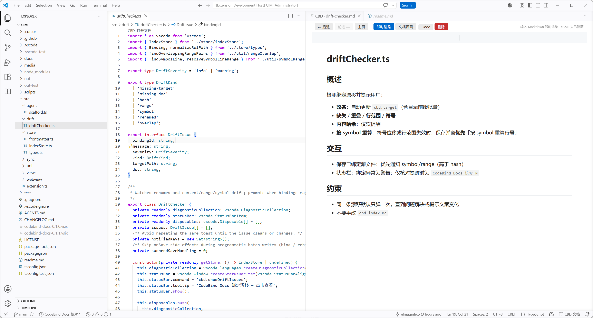

# CodeBind Docs（CBD）




**代码文档扩展**（VS Code / Cursor）：源码零侵入，文档落在仓库 Markdown 里，打开代码时左右分栏同步查看与编辑。适合人与 AI Agent 共用同一套设计上下文。

命令与设置前缀为 **`cbd`**（CodeBind Docs 简称）。

> 详细步骤见 [使用说明](docs/USER_GUIDE.md) · 产品需求见 [REQUIREMENTS](docs/REQUIREMENTS.md)

---

## 为什么用 CodeBind Docs

| 痛点 | CodeBind Docs 做法 |
|------|----------|
| 文档散落、和代码对不上 | 绑定写在文档 YAML 头，跟文件/行范围走 |
| 注释污染源码 | **不改源码**，旁路 Markdown |
| 云端文档难版本控制 | 纯本地、可 Git，无强制云端 |
| Agent 不知道读哪 | 生成 `AGENTS.md` / Cursor rules，文档就在仓库里 |

---

## 功能一览

- **分栏同步**：可选自动（`cbd.splitSync.enabled`）或手动；`Ctrl+Alt+D` 一键打开当前代码对应文档
- **整文件 / 代码块绑定**：`kind: file` 或 `range`（行范围 + 建议填 symbol）
- **即时渲染**：Vditor 类 Typora 编辑；可切纯文本源码；可选大纲 TOC
- **主页与侧栏**：绑定目录树、覆盖率、待绑定列表、漂移提醒
- **漂移治理**：改名（含目录）自动改路径；哈希软提醒；按 symbol 一键重算行号
- **资源与嵌入**：粘贴图片进 `assets/`；`cbd-include` 只读嵌入本仓库其它文档
- **Agent 友好**：Initialize 写入对照表与规则，改代码前可读绑定文档

---

## 快速开始
- VS：[codebinddocs.codebinddocs](https://marketplace.visualstudio.com/items?itemName=codebinddocs.codebinddocs)
- Cursor：[codebinddocs](https://open-vsx.org/extension/codebinddocs/codebinddocs)
1. 安装本扩展后，打开任意工作区文件夹  
2. 命令面板运行 **`CBD: Initialize`**（创建 `docs/`、`AGENTS.md` 等）  
3. 打开一个源文件，运行 **`CBD: Bind Doc to Current File`**（整文件或代码块）  
4. 之后切换源文件即可左右分栏；左侧 Activity Bar 有 **CodeBind Docs** 图标  

常用入口：

| 入口 | 作用 |
|------|------|
| 命令 `CBD: Open Docs Index` | 文档主页 |
| 源码顶部 CodeLens / 状态栏 `CodeBind Docs 文档` | 打开旁路文档 |
| 侧栏 **已绑定 / 待绑定** | 浏览与补绑 |

完整流程、设置项、命令表见 **[docs/USER_GUIDE.md](docs/USER_GUIDE.md)**。

---

## 绑定长什么样

文档目录默认 `docs/cbd/`（可用设置 `cbd.docsPath` 修改）。绑定写在 Markdown **文件头**：

```yaml
---
cbd:
  target: src/foo.ts
  kind: file          # 或 range
  startLine: 15       # 仅 range
  endLine: 44         # 仅 range
  symbol: activate    # range 强烈建议填
  contentHash: abc    # 扩展维护，一般不用手改
---
```

各字段含义：

| 字段 | 必填 | 含义 |
|------|------|------|
| `target` | 是 | 绑定的源文件路径（相对工作区根，如 `src/foo.ts`） |
| `kind` | 是 | `file` = 整文件；`range` = 某段代码块 |
| `startLine` / `endLine` | `range` 时 | 代码块起止行号（1-based，含两端） |
| `symbol` | `range` 强烈建议 | 该代码块对应的符号名（函数 / 类 / 方法等）。代码改动导致行号漂移时，可用 **按 symbol 重算行号** 自动更新 `startLine`/`endLine`；不填也能绑，但漂移后往往只能手动改绑 |
| `contentHash` | 否（扩展写入） | 绑定内容的哈希，用于软提醒「源码可能已变、文档未必同步」；一般由扩展维护 |

补充：

- **不修改**被绑定的源码文件；真相源在文档头  
- 同一源文件可有多个 `range`，至多一个 `file`；光标所在行优先匹配**最窄**的 `range`，否则回退到 `file`  
- 无 `cbd:` 头的 Markdown 不算绑定（例如本仓库的 `REQUIREMENTS.md`）  
- 新建 / 改绑代码块时，扩展会尽量从选区推断 `symbol`；留空需二次确认  

---

## 要求

- VS Code / Cursor：`engines.vscode` ≥ `1.85.0`  
- 打开**文件夹工作区**（单文件模式无法使用绑定扫描）  

---

## 文档与开发

| 文档 | 内容 |
|------|------|
| [使用说明](docs/USER_GUIDE.md) | 安装、绑定、漂移、设置、命令、FAQ |
| [产品需求](docs/REQUIREMENTS.md) | 定位、范围、数据模型 |
| [测试说明](docs/testing.md) | `npm test` |
| [开发调试](docs/DEVELOPMENT.md) | 编译、F5 / `npm run debug` |

```bash
npm install
npm run compile
npm test
```

---

## 许可

MIT
