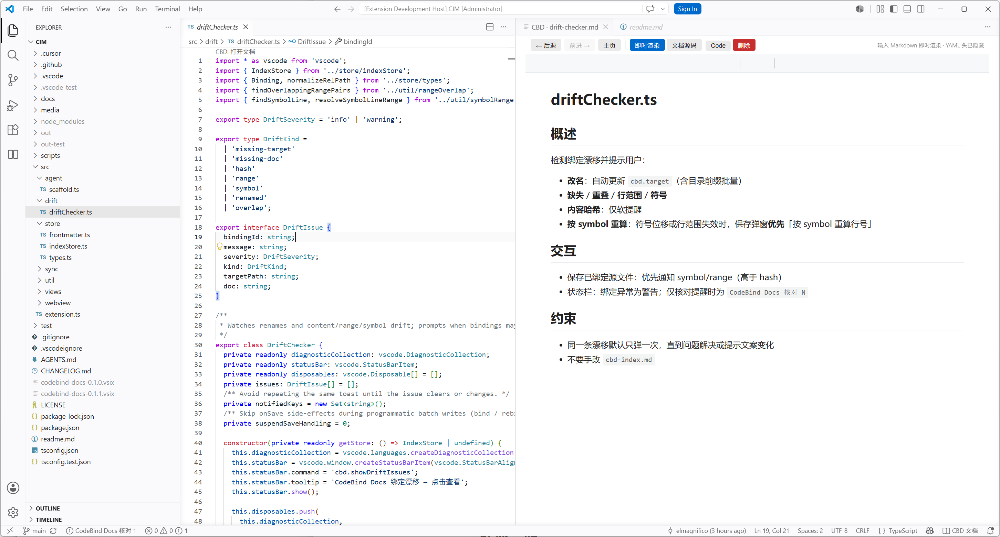

# CodeBind Docs（CBD）




**代码文档扩展**（VS Code / Cursor）：源码零侵入，文档落在仓库 Markdown 里，打开代码时左右分栏同步查看与编辑。适合人与 AI Agent 共用同一套设计上下文。

命令与设置前缀为 **`cbd`**（CodeBind Docs 简称）。

> 详细步骤见 [使用说明](docs/USER_GUIDE.md) · 产品需求见 [REQUIREMENTS](docs/REQUIREMENTS.md)

---

## 安装

- **VS Code**：[codebinddocs.codebinddocs](https://marketplace.visualstudio.com/items?itemName=codebinddocs.codebinddocs)
- **Cursor / Open VSX**：[codebinddocs.codebinddocs](https://open-vsx.org/extension/codebinddocs/codebinddocs)

扩展视图搜索 **CodeBind Docs** 亦可安装。

---

## 为什么用 CodeBind Docs

| 痛点 | CodeBind Docs 做法 |
|------|----------|
| 文档散落、和代码对不上 | 绑定写在文档 YAML 头，跟文件 / 行范围 / 目录走 |
| 注释污染源码 | **不改源码**，旁路 Markdown |
| 云端文档难版本控制 | 纯本地、可 Git，无强制云端 |
| Agent 不知道读哪 | 生成 `AGENTS.md` / Cursor rules，文档就在仓库里 |

---

## 功能一览

- **分栏同步**：可选自动（`cbd.splitSync.enabled`）或手动；`Ctrl+Alt+D` 一键打开当前代码对应文档；`Ctrl+Alt+Shift+D` 开关自动分栏
- **整文件 / 代码块 / 目录绑定**：`kind: file` · `range`（行范围 + 建议填 symbol）· `directory`（整目录说明，`CBD: Bind Doc to Folder`）
- **即时渲染**：Vditor 类 Typora 编辑；可切纯文本源码；可选大纲 TOC
- **主页与侧栏**：绑定目录树、覆盖率、待绑定列表、漂移提醒
- **漂移治理**：改名（含目录）自动改路径；哈希软提醒；按 symbol 一键重算行号
- **资源与嵌入**：粘贴图片进 `assets/`；`cbd-include` 只读嵌入本仓库其它文档
- **Agent 友好**：Initialize 写入对照表与规则，改代码前可读绑定文档

---

## 快速开始

1. 安装本扩展后，打开任意**文件夹工作区**（多根工作区时仅第一个根生效）  
2. 命令面板运行 **`CBD: Initialize`**（创建默认 `docs/cbd/`、`AGENTS.md`、Cursor rules 等）  
3. 打开一个源文件，运行 **`CBD: Bind Doc to Current File`**（整文件或代码块）；或对文件夹运行 **`CBD: Bind Doc to Folder`**  
4. 自动分栏开启时，切换源文件即可左右同步；也可随时 `Ctrl+Alt+D` 打开对应文档  
5. 左侧 Activity Bar 有 **CodeBind Docs** 图标  

常用入口：

| 入口 | 作用 |
|------|------|
| `CBD: Open Docs Index` | 文档主页 |
| `Ctrl+Alt+D` / CodeLens / 状态栏 | 打开当前源文件的旁路文档 |
| `Ctrl+Alt+Shift+D` | 开关自动分栏 |
| 侧栏 **已绑定 / 待绑定** | 浏览与补绑 |

完整流程、设置项、命令表见 **[docs/USER_GUIDE.md](docs/USER_GUIDE.md)**。

---

## 绑定长什么样

文档目录默认 **`docs/cbd/`**（设置 `cbd.docsPath` 可改；旧工作区若仍用 `docs/` 可在设置里写回）。绑定写在 Markdown **文件头**：

```yaml
---
cbd:
  target: src/foo.ts
  kind: file          # file | range | directory
  startLine: 15       # 仅 range
  endLine: 44         # 仅 range
  symbol: activate    # range 强烈建议填
  contentHash: abc    # 扩展维护，一般不用手改
---
```

目录绑定示例：

```yaml
---
cbd:
  target: src/store
  kind: directory
---
```

各字段含义：

| 字段 | 必填 | 含义 |
|------|------|------|
| `target` | 是 | 绑定的源路径（相对工作区根）：文件、或 `directory` 时的目录 |
| `kind` | 是 | `file` = 整文件；`range` = 代码块；`directory` = 整个目录 |
| `startLine` / `endLine` | `range` 时 | 代码块起止行号（1-based，含两端） |
| `symbol` | `range` 强烈建议 | 该代码块对应的符号名（函数 / 类 / 方法等）。行号漂移时可用 **按 symbol 重算行号** 更新起止行 |
| `contentHash` | 否（扩展写入） | 内容哈希，软提醒源码可能已变；`directory` 不做内容哈希 |

补充：

- **不修改**被绑定的源码文件；真相源在文档头  
- 同一源文件可有多个 `range`，至多一个 `file`；光标行优先匹配**最窄** `range`，否则回退 `file`；文件未单独绑定时可回退到所属目录的 `directory` 文档  
- 无 `cbd:` 头的 Markdown 不算绑定（例如本仓库的 `REQUIREMENTS.md`）  
- 新建 / 改绑代码块时，扩展会尽量从选区推断 `symbol`；留空需二次确认  

---

## 要求

- VS Code / Cursor：`engines.vscode` ≥ `1.85.0`  
- 打开**文件夹工作区**（单文件模式无法使用绑定扫描）  
- 多根工作区：CBD 仅使用 **`workspaceFolders[0]`**（请把要绑文档的仓放在第一位）  

---

## 文档与开发

| 文档 | 内容 |
|------|------|
| [使用说明](docs/USER_GUIDE.md) | 安装、绑定、漂移、设置、命令、FAQ |
| [产品需求](docs/REQUIREMENTS.md) | 定位、范围、数据模型 |
| [测试说明](docs/testing.md) | `npm test` |
| [开发调试](docs/DEVELOPMENT.md) | 编译、F5 / `npm run debug`、发版 |

```bash
npm install
npm run compile
npm test
```

---

## 许可

MIT
